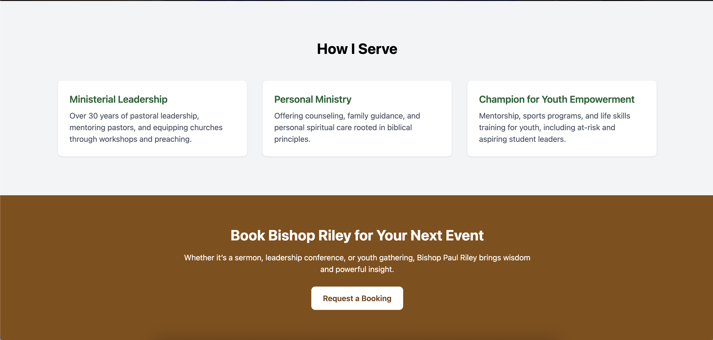
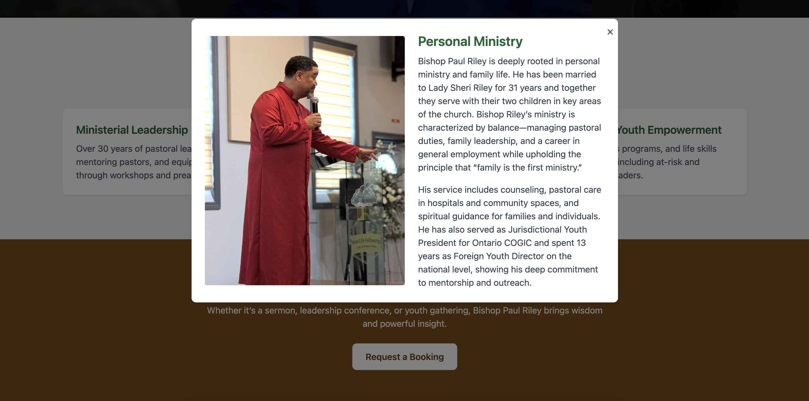
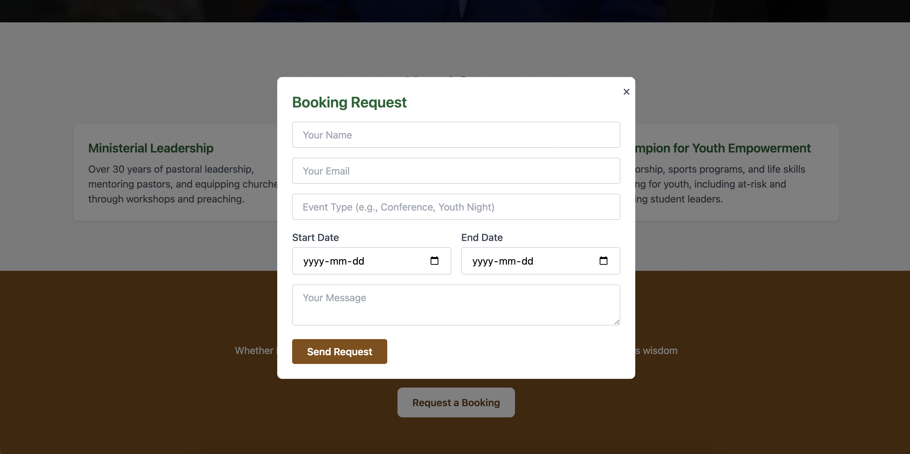

# Bishop Paul Riley – Official Website

Welcome to the official website for **Bishop Paul Riley**, a spiritual leader, youth advocate, and mentor based in Windsor, Ontario. This site highlights his ministry, personal values, and decades of impact in the community.

## 🌐 Live Site  
[https://thebishoppaulriley.com](https://bishoppaulriley.netlify.app)

---

## 📌 Purpose

This website was built to:

- Share Bishop Paul Riley’s ministry background and leadership roles  
- Showcase his services: **Ministerial Leadership**, **Personal Ministry**, and **Youth Empowerment**  
- Provide a simple way to **request a booking**  
- Create a modern, mobile-friendly site for visitors to connect and learn more

---

## 🛠 Built With

- **HTML5**  
- **Tailwind CSS**  
- **JavaScript**  
- **Netlify** for deployment

---

## 📸 Features

- ✝️ Ministry overview with biography and key service highlights  
- 🧑‍💼 Interactive service cards and modals for:
  - Ministerial Leadership  
  - Personal Ministry  
  - Champion for Youth Empowerment  
- 📅 Booking request popup form with date selection  
- 📱 Fully responsive design for mobile and desktop

---

## 📷 Screenshots
<table>
  <tr>
    <td></td>
    <td></td>
  </tr>
  <tr>
    <td></td>
    <td></td>
  </tr>
</table>

## Developed By: [Sierra RIley](@sierrariley) 
LinkedIn Profile [Here](www.linkedin.com/in/sierra-riley-a4a267146)
